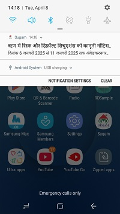
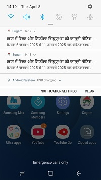
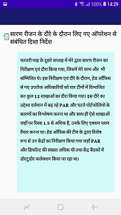
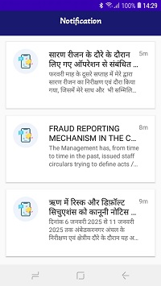
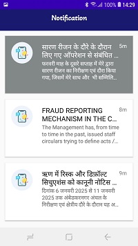
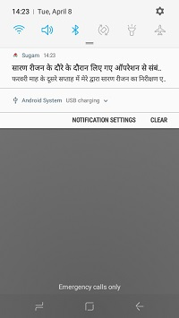

# 📲 Android Notification System with Firebase + Node.js API

This Android app integrates **Firebase Cloud Messaging (FCM)** for push notifications and uses a custom **Node.js backend with SQL database** to manage and send notifications. It also fetches and displays a notification list from a REST API.

---

## 🛠️ Tech Stack

### 🔹 Frontend (Android)
- Language: Java
- IDE: Android Studio
- Notification: Firebase Cloud Messaging (FCM)
- UI: Material Components (RecyclerView, CardView)

### 🔹 Backend (Node.js)
- Framework: Express.js
- Database: MySQL 
- ORM: Knex.js (if used)
- Firebase Admin SDK for server-side notification push

---

## 🔔 Key Features

- Receive push notifications via Firebase
- Push notifications from Node.js API
- Notification content stored in SQL database
- REST API to fetch notification history
- Notifications list view with read/unread state
- Card turns **grey** when notification is read
- Detail view on tapping any notification

---

## 📱 UI Screenshots

| Firebase Drawer | Multiple Notifications | Notification Detail |
|------------------|-------------------------|----------------------|
|  |  |  |

| Notification List | Read Highlight | More |
|------------------|----------------|------|
|  |  |  |

---

